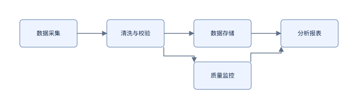

# Moon Graph

MoonBit 原生图布局与 SVG 渲染工具，适用于流程图、数据流水线、状态机和模块依赖图。核心图模型、布局、JSON / 文本解析、序列化与 SVG 均由 MoonBit 实现；Node.js 仅负责命令行参数和文件 I/O。无需 npm 依赖。

这是原创实现，借鉴 ELK JSON 的字段组织方式，**不是完整 ELK 移植，也不承诺与 elkjs 坐标一致**。具体边界见 [兼容性说明](docs/COMPATIBILITY.md)。

## 快速运行

环境：moonc 不低于 0.10.14；本项目验证版本为 moonc 0.10.14+7d59c7ec9、Moon CLI 0.1.20260920；Node.js 20 或以上。进入本目录：

~~~sh
moon check
moon test
npm run build
node cli/moon-graph.mjs examples/pipeline.json --format svg --output examples/pipeline.svg
node cli/moon-graph.mjs examples/hierarchy-ports.json --pretty
node cli/moon-graph.mjs examples/workflow.txt --input-format text --format svg
node cli/moon-graph.mjs --algorithms
moon run examples/api
~~~

无需运行 npm install。npm run build 执行 moon build --target js --release，生成 CLI 使用的 ESM 桥接模块。直接运行默认 debug 构建不会更新 release 模块。

## 实现的能力

- 层级图模型：节点、复合节点、边、四边端口、文字标签，所有对象 ID 全局唯一。
- 五种可选算法：layered、force、radial、box、fixed。
- 分层布局支持有向环处理、最长路径分层与重心排序；不改变原始边的方向。
- 层级容器自底向上布局；子容器继承父容器配置并可覆盖。
- 正交 / 折线路由、自环、端口锚点，输出每条边一个 section。
- JSON 往返、稳定字段输出、pretty print，以及简洁的逐行文本输入。
- SVG 自动边界、箭头、端口与中文标签；所有用户文本均转义为 XML 文本。
- 结构、选项和输出范围校验；layout 返回深拷贝，不修改输入图。

## CLI

~~~text
node cli/moon-graph.mjs [input-file|-] [options]
  --input-format json|text   默认 json
  --format json|svg          默认 json
  --algorithm NAME          覆盖根节点算法
  --direction DIRECTION     RIGHT / DOWN / LEFT / UP
  --pretty                  JSON 缩进输出
  --output PATH             写入指定文件，默认 stdout
  --algorithms              输出算法名称 JSON 数组
  --help                    查看帮助
  --                        结束选项解析
~~~

不传输入路径或传 - 时读取 stdin。输入输出使用 UTF-8；非法编码、重复参数、未知参数和缺失参数值均报错。参数值需空格分隔，不支持 --key=value。错误写到 stderr，参数错误返回 2，解析 / 布局 / 文件错误返回 1，成功返回 0。输出文件的父目录须已存在。

CLI 先解析并验证原始图，再应用根节点覆盖参数；覆盖参数不能用来修复原始文件中的非法选项。--pretty 对 SVG 无额外效果。

## MoonBit API

在 moon.pkg 中导入 local/moon_graph/graph，可直接运行完整样例 examples/api/main.mbt：

~~~moonbit
let graph = @graph.new_graph()
graph.children.push(@graph.new_node("build", width=120.0, height=52.0))
graph.children.push(@graph.new_node("test"))
graph.edges.push(@graph.new_edge("build-test", "build", "test"))
graph.options["elk.algorithm"] = "layered"
let output = @graph.new_elk_engine().layout(graph)
let json = @graph.graph_json(output, pretty=true)
let svg = @graph.render_svg(output)
~~~

layout、parse_graph、parse_text、layout_json 会抛出 GraphError，调用者需在可抛错函数中调用或使用 catch。validate(graph) 返回错误字符串数组。clone_graph、graph_json 和 render_svg 假定输入是有效、无循环引用的层级对象树，不负责校验手工构造的可变对象；边的有向环允许存在，这与对象树循环引用不同。从外部输入构建图时先调用解析 API 或 validate，渲染一般应使用 layout 返回值。

其他入口：

~~~moonbit
let graph = @graph.parse_graph(input)
let compact = @graph.graph_json(graph)
let laid_out_json = @graph.layout_json(input, pretty=true)
let text_graph = @graph.parse_text("node a 开始\nnode b 结束\nedge e a b")
let names = @graph.algorithms()
let problems = @graph.validate(graph)
~~~

浏览器或其他 JS 宿主可导入编译后的 _build/js/release/build/bridge/bridge.js。transform(input, inputFormat, outputFormat, algorithm, direction, pretty) 的六个参数均为字符串；空 algorithm/direction 表示不覆盖，pretty 传 "true" 或 "false"。返回 JSON 字符串：成功为 {"ok":true,"data":"..."}，输入错误为 {"ok":false,"error":"..."}。list_algorithms() 返回 JSON 数组字符串。宿主仍需捕获资源耗尽等非业务异常。

## 算法与选项

| 算法 | 适用场景 | 行为 |
| --- | --- | --- |
| layered | 流程图、数据流、状态机 | 贪心反馈排序处理环，分层与重心排序 |
| force | 一般关系图 | 固定种子的斥力 / 弹簧迭代，随后排除重叠 |
| radial | 树状或层级关系 | BFS 环状分层；重叠消解可能改变精确圆环形状 |
| box | 元素目录、无边图 | 按行装箱，保留节点尺寸 |
| fixed | 手动位置、已布局图 | 保留节点 x/y，重新计算容器边界、端口与路由 |

所有算法支持嵌套容器。尺寸不小于输入尺寸；复合节点会按内容扩展。fixed 不消除用户给定的重叠。布局不保证全局最优、无交叉或边避障。

节点的 layoutOptions 支持以下完整白名单：

| 键 | 默认值 | 允许值 |
| --- | --- | --- |
| elk.algorithm | layered | 五个算法名，或 org.eclipse.elk. 加算法名 |
| elk.direction | RIGHT | RIGHT / DOWN / LEFT / UP |
| elk.spacing.nodeNode | 30 | 0..10000 |
| elk.layered.spacing.nodeNodeBetweenLayers | 60 | 0..10000 |
| moon.padding | 24 | 0..10000 |
| moon.force.iterations | 120 | 整数 1..1000 |
| moon.seed | 1 | 整数 0..1000000 |
| elk.edgeRouting | ORTHOGONAL | ORTHOGONAL / POLYLINE |

端口仅接受 elk.port.side，值为 NORTH / SOUTH / EAST / WEST，默认 EAST；同侧端口均匀分布。不存在任意固定端口坐标约束。数值选项可用 JSON 数字或数字字符串；选项字符串区分大小写。未知键和不支持的算法会明确报错。

## 输入格式与限制

最小 JSON：

~~~json
{
  "id": "root",
  "children": [{"id": "a"}, {"id": "b"}],
  "edges": [{"id": "e", "sources": ["a"], "targets": ["b"]}]
}
~~~

叶子节点默认 100×48；坐标默认为 0。端点只能引用边所在容器的直接子节点或这些子节点的端口。将外层边连到复合节点的端口，内层边保存在该复合节点的 edges 中；跨容器直连不支持。所有节点、边、端口共用 ID 命名空间。

文本语法：node ID [标签词...]、edge ID SOURCE TARGET [标签词...]、option KEY VALUE。支持空行与整行 # 注释，可先声明边。标签中的连续空白折叠成一个空格，不解析引号、转义、内联注释；层级、端口和尺寸请用 JSON / MoonBit API。该文本格式是项目自定义格式，不是 ELK Text 语法。

边界：输入最多 1 MiB UTF-8，500 个节点（包含根节点）、3000 条边、5000 个端口、层级深度最大 32（根深度为 0）。ID 非空且长度最多 256；坐标、尺寸及路由点有限、非负且不超过 1000000，叶子节点尺寸必须为正。每条输入边最多 1000 个点。布局后超限同样报错。算法同步执行，force 为平方级节点交互，适合小中型图，不是超大图服务。

## 验证与文件结构

~~~sh
moon fmt --check
moon check --target wasm-gc
moon check --target js
moon test --target wasm-gc
moon test --target js
npm run build
npm test
npm run examples
~~~

graph/ 包含 MoonBit 库与测试；bridge/ 为字符串边界；cli/ 为无依赖 CLI 和真实子进程测试；examples/ 包含流水线、层级端口、环、自定义文本以及 API 示例；scripts/render-examples.mjs 使用 MoonBit CLI 生成四个 SVG。测试设计见 [TESTING.md](docs/TESTING.md)，项目申报文本见 [PROJECT_PROPOSAL.md](PROJECT_PROPOSAL.md)。

MIT 许可证。项目中未复制 ELK / elkjs 实现代码。ELK 是参考生态项目的名称，未暗示官方关联或认证。

## 验收和发布状态

本地核验清单见 [ACCEPTANCE.md](docs/ACCEPTANCE.md)。当前源码与测试可在本地复现，尚未发布本项目的 GitHub 提交或 mooncakes 包；不要把本地打包成功视为发布完成。

当前嵌套仓库使用父目录的 .github/workflows/moon-graph.yml；若将本文件夹作为独立仓库根目录，使用本目录自带的 .github/workflows/ci.yml。两种配置都覆盖检查、构建、测试。实际 CI 成功记录须在上传之后核实。

发布前须将 moon.mod 中 local/moon_graph 换成自己拥有的 mooncakes 用户名或组织名，并同步替换 bridge/moon.pkg 和 examples/api/moon.pkg 的导入路径，填写真实 repository。详细步骤见 [PUBLISHING.md](docs/PUBLISHING.md)。
